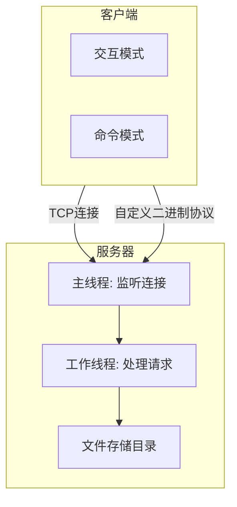
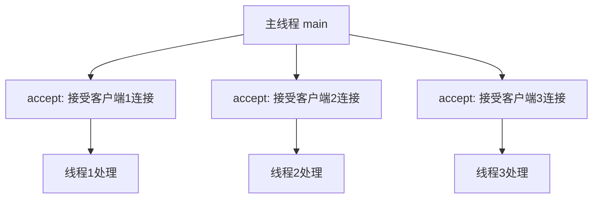

# 图表使用说明

## 📊 已生成的Mermaid图表文件

```
/home/calendar/code/keshe/charts/
├── 图2-1_系统架构图.mmd
├── 图2-3_多线程模型.mmd
├── 图2-4_系统模块结构图.mmd
├── 图2-5_消息序列化流程.mmd
├── 图2-6_文件上传流程.mmd
└── 图2-7_服务端工作线程流程.mmd
```

## 🚀 三种生成图表的方法

### 方法1：在线渲染（最快，无需安装）⭐ 推荐

1. **访问在线Mermaid编辑器：**
   - https://mermaid.live
   - https://draw.io (支持Mermaid)

2. **使用步骤：**
   - 打开网站
   - 将 `.mmd` 文件内容复制粘贴到编辑器
   - 实时预览图表效果
   - 点击导出PNG/SVG
   - 下载到本地

3. **优势：**
   - 无需安装任何软件
   - 实时预览，便于调整
   - 支持多种导出格式
   - 可分享链接给他人

---

### 方法2：安装mermaid-cli（本地生成）

#### 安装命令：

```bash
# 使用npm（需要先安装Node.js）
npm install -g @mermaid-js/mermaid-cli

# 或使用yarn
yarn global add @mermaid-js/mermaid-cli

# 或使用Homebrew (macOS)
brew install mermaid-cli
```

#### 生成图表：

```bash
cd /home/calendar/code/keshe/charts

# 生成单个图表
mmdc -i 图2-1_系统架构图.mmd -o 图2-1_系统架构图.png -w 1200 -H 800

# 批量生成所有图表
for file in *.mmd; do
    mmdc -i "$file" -o "${file%.mmd}.png" -w 1200 -H 800
done
```

#### 高级选项：

```bash
# 自定义背景色
mmdc -i input.mmd -o output.png --backgroundColor white

# 调整DPI（更清晰）
mmdc -i input.mmd -o output.png --scale 2

# 导出SVG格式（矢量图）
mmdc -i input.mmd -o output.svg
```

---

### 方法3：使用VSCode插件

1. **安装VSCode插件：**
   - Markdown Preview Mermaid Support
   - Mermaid Chart

2. **使用步骤：**
   - 在VSCode中打开 `.mmd` 文件
   - 右键选择"Preview Mermaid"
   - 截图或导出

---

## 📝 在Word文档中插入图表

### 步骤：

1. **生成图表图片**
   - 使用上述任一方法生成PNG/SVG图片

2. **打开Word文档**
   - 文件位置：`/home/calendar/code/keshe/基于C语言的文件传输服务器设计与实现.docx`

3. **定位到图表位置**
   - 找到图表标题，如"图 2-1 系统架构图"

4. **插入图片**
   - 删除原来的ASCII图表
   - 插入 → 图片 → 此设备
   - 选择生成的PNG文件

5. **调整图片格式**
   - 右键图片 → 大小和位置
   - 设置宽度为14cm左右（适合A4页面）
   - 居中对齐

6. **添加图片标题**
   - 在图片下方添加标题
   - 格式：宋体，小五（10磅）
   - 居中对齐

---

## 🎨 图表预览

### 图2-1 系统架构图


### 图2-3 多线程模型


---

## 💡 技巧和建议

### 1. 图表尺寸建议
- **宽度：** 1200-1600像素
- **高度：** 800-1000像素
- **DPI：** 150-300（打印用300）

### 2. 颜色搭配
- 使用一致的配色方案
- 主色调：蓝色系（专业感）
- 强调色：橙色/红色（重点突出）

### 3. 字体设置
- 中文：微软雅黑或黑体
- 英文：Arial或Helvetica
- 字号：12-14px

### 4. 布局优化
- 保持简洁，避免过度装饰
- 对齐元素，保持整洁
- 留白适当，不拥挤

---

## 🔧 故障排除

### 问题1：中文显示乱码
```bash
# 设置环境变量
export LANG=zh_CN.UTF-8
export LC_ALL=zh_CN.UTF-8
```

### 问题2：图表太小/太大
```bash
# 调整尺寸参数
mmdc -i input.mmd -o output.png -w 1600 -H 1000
```

### 问题3：生成失败
```bash
# 检查mermaid语法
mmdc -i input.mmd -o output.png --quiet

# 使用详细模式查看错误
mmdc -i input.mmd -o output.png --verbose
```

---

## 📚 参考资源

- [Mermaid官方文档](https://mermaid-js.github.io/mermaid/)
- [Mermaid Live Editor](https://mermaid.live)
- [Mermaid Cheat Sheet](https://mermaid-js.github.io/mermaid/#/cheatsheet)
- [draw.io](https://draw.io) - 支持Mermaid的在线绘图工具

---

**生成时间：** 2026年5月18日
**文件路径：** `/home/calendar/code/keshe/charts/`
