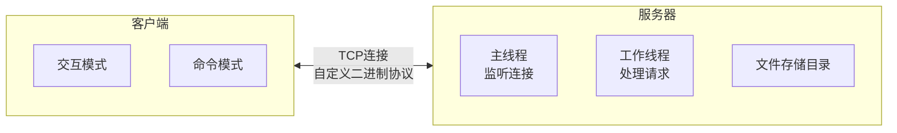
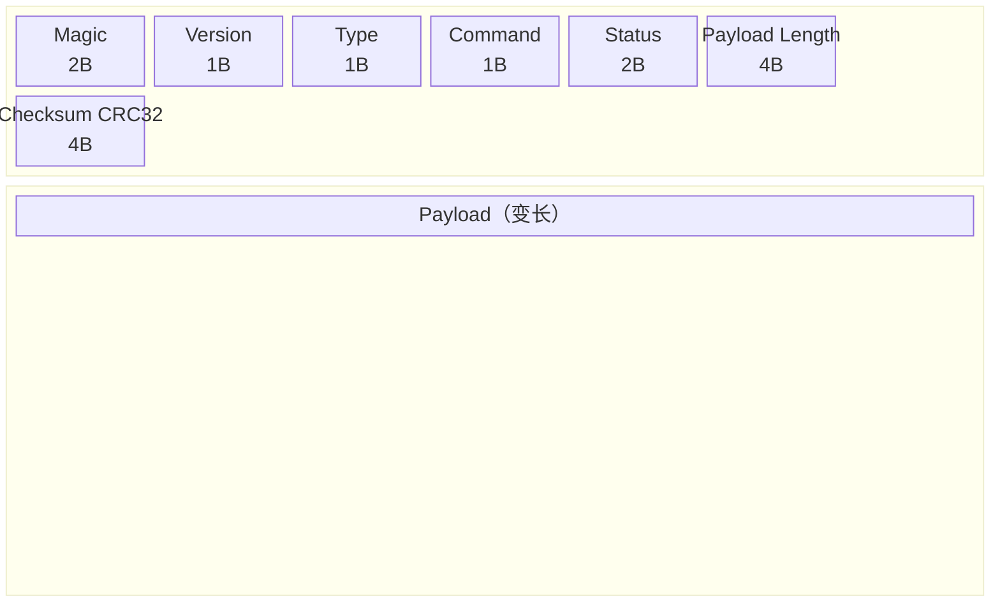
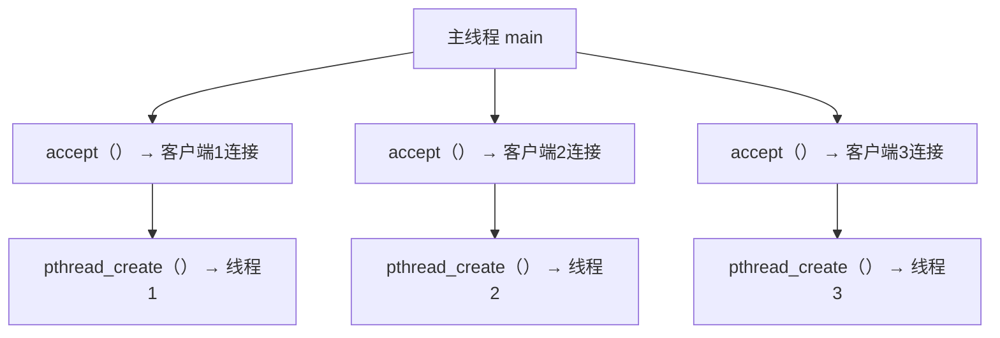
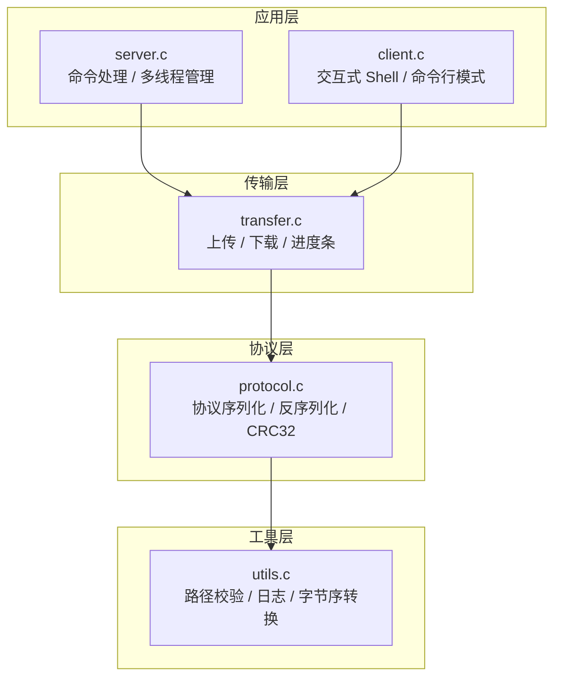
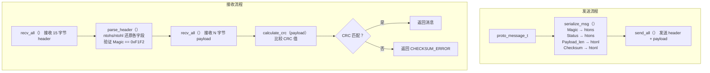
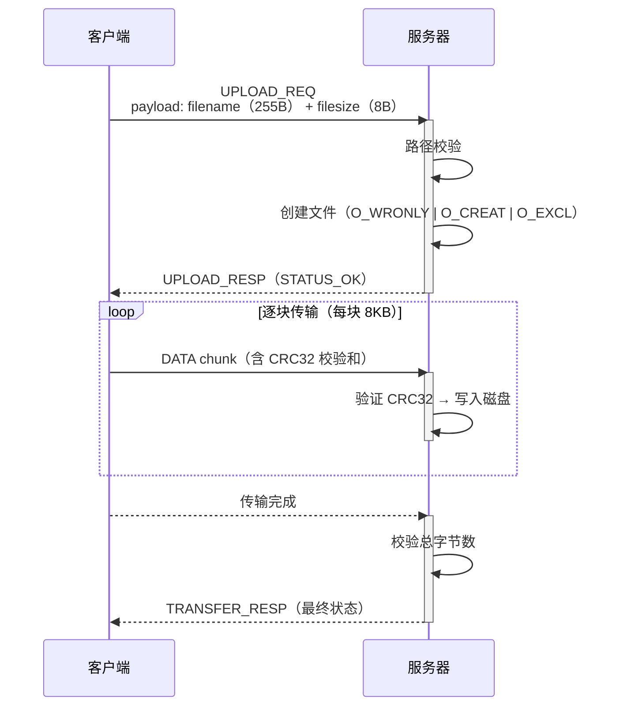
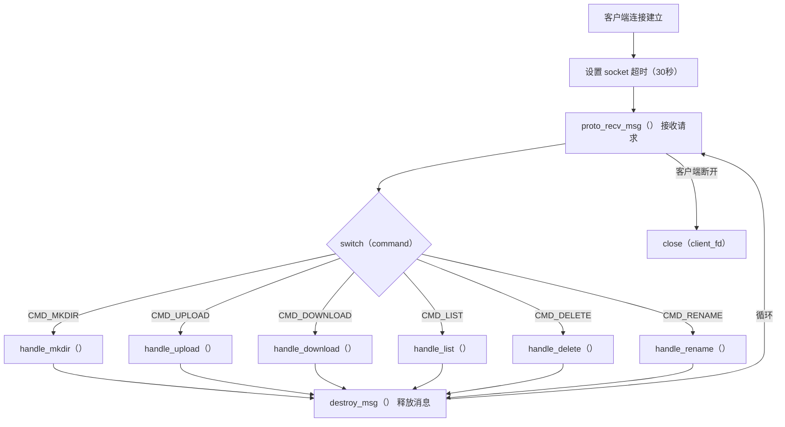

# Mermaid 图表代码汇总

> 以下为课程设计报告中的所有 Mermaid 图表代码，供截图使用。

## 图 2-1：系统架构图截图

## 图 2-2：协议格式图截图

## 图 2-3：多线程模型图截图

## 图 2-4：系统模块结构图截图

## 图 3-1：消息序列化与反序列化流程图截图

## 图 3-2：文件上传流程图截图

## 图 3-3：服务端工作线程处理流程图截图

