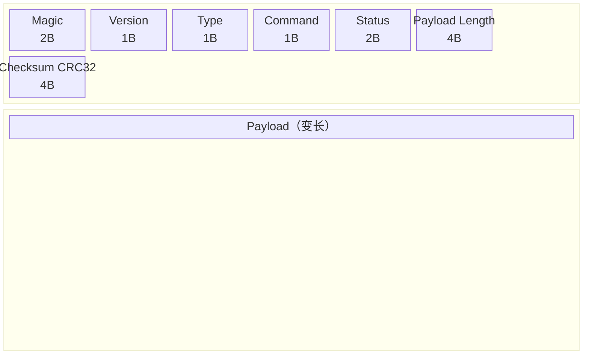
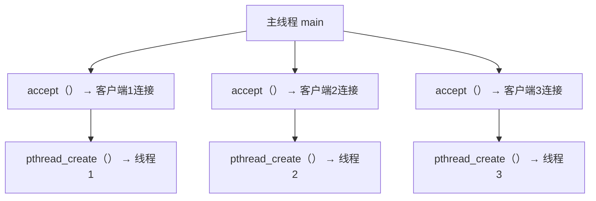
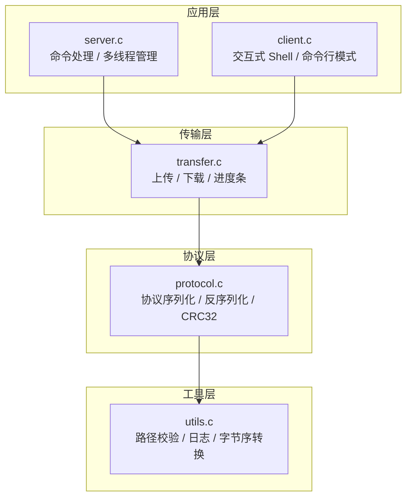
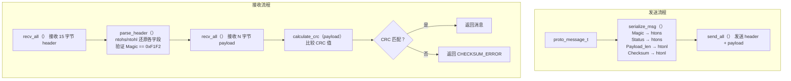
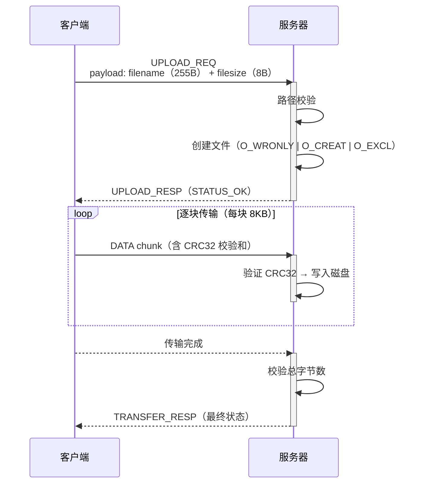
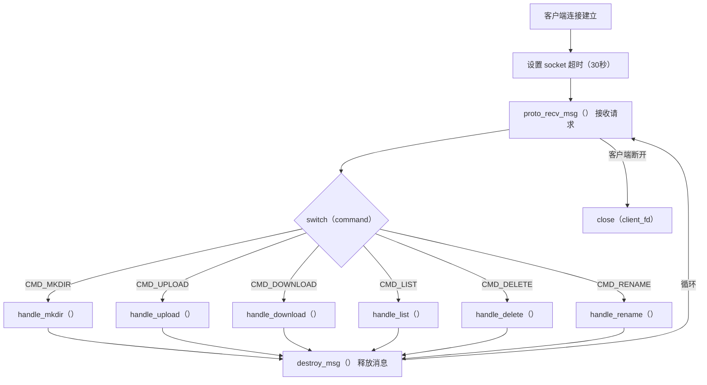

# 基于C语言的文件传输服务器设计与实现

## 摘要

随着计算机网络技术的不断发展，文件传输作为网络最基础的应用之一，在软件分发、数据备份、日志收集等场景中发挥着重要作用。传统的文件传输协议如 FTP 功能完善但协议复杂度高，对于嵌入式系统或特定应用场景而言过于庞大。本文设计并实现了一个基于 C 语言的轻量级文件传输服务器系统，采用自定义二进制协议在 TCP 连接上实现文件和目录的远程管理。系统采用客户端-服务器（C/S）架构，服务端基于 POSIX pthread 多线程模型支持多客户端并发访问。协议层实现了 CRC32 循环冗余校验保证数据完整性，应用层提供了文件上传下载、目录管理和交互式命令行 Shell 等功能。系统在 Arch Linux 环境下通过了 10 项集成测试，验证了功能正确性和安全防护有效性。

**关键词：**文件传输；C语言；TCP Socket；自定义协议；CRC32；多线程

## 目 录

[第一章 绪论](#第一章-绪论)

> [1.1 项目完成情况](#11-项目完成情况)
>
> [1.2 课程设计背景](#12-课程设计背景)
>
> [1.3 相关技术](#13-相关技术)

[第二章 需求分析和设计](#第二章-需求分析和设计)

> [2.1 需求分析](#21-需求分析)
>
> [2.2 总体设计](#22-总体设计)
>
> [2.3 本章小结](#23-本章小结)

[第三章 详细设计及实现](#第三章-详细设计及实现)

> [3.1 协议模块设计与实现](#31-协议模块设计与实现)
>
> [3.2 文件传输模块设计与实现](#32-文件传输模块设计与实现)
>
> [3.3 服务端模块设计与实现](#33-服务端模块设计与实现)
>
> [3.4 客户端模块设计与实现](#34-客户端模块设计与实现)
>
> [3.5 本章小结](#35-本章小结)

[第四章 测试](#第四章-测试)

> [4.1 测试环境](#41-测试环境)
>
> [4.2 测试结果](#42-测试结果)
>
> [4.3 本章小结](#43-本章小结)

[第五章 课程设计总结](#第五章-课程设计总结)

[参考文献](#参考文献)

---

## 第一章 绪论

### 1.1 项目完成情况

本课程设计实现了一个基于 C 语言的文件传输服务器系统，采用客户端-服务器（C/S）架构，支持多客户端并发访问。系统通过自定义二进制协议在 TCP 连接上实现文件和目录的远程管理，具备完整的错误处理、数据校验和安全防护机制。

项目主要完成以下功能：

（1）自定义二进制通信协议：设计了包含魔数校验、版本控制、命令分发、状态码反馈和 CRC32 校验的 15 字节协议头，支持请求、响应和数据三种消息类型。

（2）文件传输功能：支持文件的上传和下载，采用 8KB 分块传输策略，传输过程中显示实时进度条和速率信息，并通过 CRC32 校验保证数据完整性。

（3）目录管理功能：支持远程创建目录（mkdir）、列目录（list）及查看子目录内容，目录列表包含文件类型、大小和修改时间等详细信息。

（4）文件管理功能：支持文件和目录的删除（delete）及重命名（rename）操作。

（5）安全防护：实现了路径遍历攻击防护，禁止使用".."和绝对路径，所有文件操作均限制在服务器根目录范围内。

（6）多线程并发：服务端采用 pthread 多线程模型，每个客户端连接由独立线程处理，支持多客户端同时操作。

（7）交互式客户端：提供交互式命令行 Shell（fshell），支持连接复用，同时保留命令行单次执行模式，支持批量文件上传。

（8）健壮性设计：包括 SIGPIPE 信号忽略、SIGINT 优雅退出、Socket 超时机制和编译期协议断言等。

项目源代码总量约 2000 行，其中 C 语言源码 1646 行，测试脚本 197 行。全部 10 项集成测试用例均通过。

### 1.2 课程设计背景

文件传输是计算机网络中最基础和最常用的应用之一。自 ARPANET 诞生以来，文件传输协议就一直是网络应用的核心组成部分。1971 年，RFC 114 定义了最早的文件传输协议（FTP），此后 FTP 经过多次修订（RFC 959, RFC 3659），成为互联网标准协议之一[1]。随着网络技术的发展，又相继出现了 TFTP（RFC 1350）、SFTP（SSH File Transfer Protocol）等适用于不同场景的文件传输协议[2]。

在工业界，文件传输服务器广泛应用于软件分发、数据备份、日志收集和内容分发等领域。传统的 FTP 服务器如 vsftpd、ProFTPD 等功能完善，但协议复杂度高，对于嵌入式系统或特定应用场景而言过于庞大。因此，设计一个轻量级、可定制的文件传输服务器具有实际工程价值[3]。

在学术研究方面，网络编程和并发服务器设计一直是计算机网络课程的核心教学内容。多线程并发模型、自定义协议设计、数据完整性校验等技术是网络编程的重要基础知识[1][4]。本项目将这些理论知识综合应用于一个完整的网络应用系统，有助于深入理解 C/S 架构的工作原理和网络编程的核心技术。

### 1.3 相关技术

**（1）TCP/IP 协议与 Socket 编程**

TCP（传输控制协议）是一种面向连接的、可靠的传输层协议，通过三次握手建立连接，提供有序、无差错的数据流传输服务[1]。Socket（套接字）是 TCP/IP 协议的编程接口，POSIX Socket API 定义了一组标准函数，包括 socket()、bind()、listen()、accept()、connect()、send() 和 recv() 等，用于实现网络通信程序[5]。本项目基于 POSIX Socket API 实现客户端与服务器之间的 TCP 通信。

**（2）多线程编程（POSIX Threads）**

POSIX Threads（pthread）是类 Unix 系统上的线程标准，提供线程创建、同步和管理功能[6]。本项目采用"每连接一线程"（thread-per-connection）的并发模型，主线程负责监听和接受连接，每个新连接由 pthread_create() 创建独立的工作线程进行处理。该模型实现简单，适合连接数不高的场景。

**（3）CRC32 循环冗余校验**

CRC（Cyclic Redundancy Check）是一种基于多项式除法的错误检测码算法。CRC32 使用 32 位校验值，其生成多项式为 0x04C11DB7（IEEE 802.3 标准）[7][8]。发送方计算数据的 CRC32 值并附加在数据后面，接收方重新计算并比较，若不一致则说明数据在传输过程中发生了错误。CRC32 具有检错能力强、计算效率高的特点，广泛应用于网络传输、文件校验和存储系统中。本项目采用查表法实现 CRC32，通过预计算 256 项查找表将计算复杂度从 O(n×32) 降低到 O(n)。

**（4）自定义二进制协议设计**

网络协议定义了通信双方交换数据的格式和规则。与文本协议（如 HTTP、FTP）相比，二进制协议具有传输效率高、解析速度快的优点，常用于对性能要求较高的场景[4]。本项目设计了一种轻量级二进制协议，包含魔数标识、版本号、消息类型、命令码、状态码、负载长度和校验和等字段，实现了请求-响应模式的可靠通信。

---

## 第二章 需求分析和设计

### 2.1 需求分析

**功能需求：**

（1）文件上传：客户端能够将本地文件上传至服务器指定目录，支持大文件分块传输，传输过程应显示进度信息。

（2）文件下载：客户端能够从服务器下载指定文件到本地，支持大文件传输和完整性校验。

（3）目录管理：支持在服务器上创建目录、列出目录内容（含文件类型、大小和修改时间信息），支持查看子目录。

（4）文件删除：支持删除服务器上的文件和空目录。

（5）文件重命名：支持对服务器上的文件和目录进行重命名操作。

（6）交互式操作：提供命令行交互界面，支持连接复用，减少频繁建连开销。

**非功能需求：**

（1）并发性：服务器应支持多个客户端同时连接和操作，互不干扰。

（2）可靠性：传输数据应有完整性校验机制，能检测传输错误。

（3）安全性：应防止路径遍历攻击，限制文件操作在服务器根目录范围内。

（4）健壮性：服务器应具备异常处理能力，包括信号处理、超时机制和内存管理等。

### 2.2 总体设计

#### 2.2.1 系统架构

系统采用经典的 C/S（客户端-服务器）架构。服务器端监听指定端口，接受客户端连接请求；客户端通过 TCP 连接与服务器通信，发送命令请求并接收响应。系统架构如图 2-1 所示。


[此处插入图 2-1：系统架构图截图]

#### 2.2.2 协议格式设计

自定义协议的消息格式由固定长度的头部（15 字节）和可变长度的负载组成。协议头部格式如图 2-2 所示。



[此处插入图 2-2：协议格式图截图]

协议各字段说明如表 2-1 所示。

表 2-1 协议头部字段说明

| 字段 | 偏移 | 大小 | 说明 |
|------|------|------|------|
| Magic | 0 | 2字节 | 魔数标识 0xF1F2，用于协议识别 |
| Version | 2 | 1字节 | 协议版本号，当前为 0x01 |
| Type | 3 | 1字节 | 消息类型：0=请求，1=响应，2=数据 |
| Command | 4 | 1字节 | 命令码：0x01=mkdir，0x02=rename，0x10=upload，0x11=download，0x12=list，0x20=delete |
| Status | 5 | 2字节 | 状态码（网络字节序） |
| Payload Length | 7 | 4字节 | 负载长度（网络字节序，最大 4GB） |
| Checksum | 11 | 4字节 | 负载数据的 CRC32 校验值 |

#### 2.2.3 状态码设计

系统定义了以下状态码用于反馈操作结果，如表 2-2 所示。

表 2-2 状态码定义

| 状态码 | 值 | 说明 |
|--------|------|------|
| STATUS_OK | 0x0000 | 操作成功 |
| STATUS_FILE_NOT_FOUND | 0x0001 | 文件不存在 |
| STATUS_EXISTS | 0x0002 | 文件或目录已存在 |
| STATUS_INVALID_PATH | 0x0003 | 非法路径（路径遍历攻击） |
| STATUS_IO_ERROR | 0x0004 | 磁盘读写错误 |
| STATUS_CHECKSUM_ERROR | 0x0005 | CRC校验失败 |
| STATUS_INTERNAL_ERROR | 0x00FF | 未知内部错误 |

#### 2.2.4 线程模型

服务端采用"每连接一线程"的并发模型，如图 2-3 所示。每个工作线程独立循环接收和处理客户端请求，直到客户端断开连接。线程通过 pthread_detach() 设置为分离状态，结束后自动回收资源。



[此处插入图 2-3：多线程模型图截图]

#### 2.2.5 模块划分

系统按功能分层划分为多个模块，模块间依赖关系如图 2-4 所示。



[此处插入图 2-4：系统模块结构图截图]

### 2.3 本章小结

本章从需求分析出发，明确了系统的功能需求和非功能需求。在此基础上进行了总体设计，包括系统 C/S 架构、自定义二进制协议格式、状态码体系、多线程并发模型和模块化分层划分。系统设计遵循模块化原则，将应用层、传输层、协议层和工具层清晰分离，各模块职责明确、接口清晰，为后续的详细实现奠定了基础。

---

## 第三章 详细设计及实现

### 3.1 协议模块设计与实现

协议模块（protocol.c / protocol.h）负责消息的创建、序列化、发送、接收和校验，是整个系统通信的基础。

#### 3.1.1 数据结构设计

协议消息由头部和负载两部分组成，使用如下结构体表示：

```c
// 协议头部（15字节，使用packed属性消除对齐填充）
typedef struct {
    uint16_t magic;        // 魔数 0xF1F2
    uint8_t  version;      // 版本号
    uint8_t  type;         // 消息类型
    uint8_t  command;      // 命令码
    uint16_t status;       // 状态码
    uint32_t payload_len;  // 负载长度
    uint32_t checksum;     // CRC32校验和
} __attribute__((packed)) proto_header_t;

// 完整消息
typedef struct {
    proto_header_t header;
    uint8_t *payload;      // 可变长度负载
} proto_message_t;
```

通过 `__attribute__((packed))` 属性确保结构体紧密排列，大小恰好为 15 字节，并使用编译期断言 `_Static_assert(sizeof(proto_header_t) == 15, ...)` 进行验证。

#### 3.1.2 CRC32 校验实现

CRC32 采用查表法实现。首先在初始化阶段预计算 256 项查找表，然后在计算时逐字节查表并异或，关键代码如下：

```c
void crc_fill_table() {
    uint32_t target = 0xEDB88320;  // 反转多项式
    for (uint32_t i = 0; i < 256; i++) {
        uint32_t crc = i;
        for (int j = 0; j < 8; j++) {
            if (crc & 1)
                crc = (crc >> 1) ^ target;
            else
                crc >>= 1;
        }
        crc32_table[i] = crc;
    }
}

uint32_t calculate_crc(const uint8_t *data, size_t len) {
    uint32_t crc = 0xFFFFFFFF;
    for (size_t i = 0; i < len; i++) {
        uint8_t index = (crc ^ data[i]) & 0xFF;
        crc = (crc >> 8) ^ crc32_table[index];
    }
    return ~crc;
}
```

#### 3.1.3 消息序列化流程

发送消息时，将 proto_message_t 结构体序列化为网络字节序的字节流；接收消息时，反序列化还原为结构体。完整的发送与接收流程如图 3-1 所示。



[此处插入图 3-1：消息序列化与反序列化流程图截图]

#### 3.1.4 可靠的 TCP I/O

TCP 是流式协议，单次 send/recv 可能无法传输完整数据。系统封装了 send_all() 和 recv_all() 函数，通过循环确保数据完整传输，并处理 EINTR（系统调用被信号中断）异常：

```c
int send_all(int sockfd, const void *buf, size_t len) {
    const uint8_t *ptr = (const uint8_t *)buf;
    size_t total_send = 0;
    while (total_send < len) {
        ssize_t n = send(sockfd, ptr + total_send, len - total_send, 0);
        if (n <= 0) {
            if (n < 0 && errno == EINTR)
                continue;
            return -1;
        }
        total_send += n;
    }
    return 0;
}
```

### 3.2 文件传输模块设计与实现

文件传输模块（transfer.c）负责文件的上传和下载操作，包含进度条显示功能。

#### 3.2.1 上传流程

客户端上传文件的流程如图 3-2 所示。上传请求的 payload 包含 255 字节的文件名和 8 字节小端序的文件大小。



[此处插入图 3-2：文件上传流程图截图]

服务器收到请求后验证路径合法性并以 O_EXCL 模式创建文件（防止覆盖已有文件），然后逐块接收数据，每块均进行 CRC 校验后写入磁盘。如果传输过程中任何一块校验失败或传输中断，服务器将删除已写入的部分文件并返回错误状态。

#### 3.2.2 下载流程

下载流程与上传类似。客户端发送 DOWNLOAD_REQ，服务器通过 stat() 获取文件大小并返回给客户端，然后逐块发送 DATA 消息。客户端接收完所有数据块后发送确认响应。如果接收过程中出现错误，客户端删除已下载的部分文件。

#### 3.2.3 进度条实现

进度条通过 progress_t 结构体记录传输状态，在每次发送或接收数据块后更新显示。进度条格式如下：

```
[###########.........] 55% 1.23 MB/s Uploading
```

包含进度条、百分比、实时速率和操作标签。速率计算基于 time() 函数的时间差。

### 3.3 服务端模块设计与实现

服务端模块（server.c）是系统的核心，负责连接管理、命令分发和文件操作。

#### 3.3.1 服务端主循环

服务器启动后，创建 TCP 监听套接字，绑定地址并进入 accept 主循环。每接受一个客户端连接，创建一个新的 pthread 工作线程进行处理。关键代码如下：

```c
while (running) {
    int *fd_ptr = malloc(sizeof(int));
    *fd_ptr = accept(listen_fd, (struct sockaddr *)&client_addr, &addr_len);
    if (*fd_ptr < 0) { free(fd_ptr); continue; }

    pthread_t tid;
    pthread_create(&tid, NULL, client_handler, fd_ptr);
    pthread_detach(tid);
}
```

#### 3.3.2 工作线程处理流程

每个工作线程在一个循环中接收客户端请求，根据命令码分发到对应的处理函数，流程如图 3-3 所示。



[此处插入图 3-3：服务端工作线程处理流程图截图]

#### 3.3.3 路径安全校验

所有文件操作命令在执行前均进行路径校验，防止路径遍历攻击。校验逻辑在 utils.c 中实现：

```c
int path_validate(const char *path) {
    if (path == NULL || path[0] == '/')  // 禁止绝对路径
        return -1;
    char *segment = strtok(path_copy, "/");
    while (segment != NULL) {
        if (strcmp(segment, "..") == 0)  // 禁止上级目录引用
            return -1;
        segment = strtok(NULL, "/");
    }
    return 0;
}
```

路径解析函数将根目录与客户端路径拼接，确保所有操作限制在根目录范围内。

#### 3.3.4 命令处理流程

以 handle_upload 为例，命令处理的典型步骤为：

（1）检查 payload 长度是否满足最小要求（255 + 8 字节）；

（2）提取文件名和文件大小；

（3）验证文件路径安全性；

（4）以 O_WRONLY | O_CREAT | O_EXCL 模式打开文件；

（5）发送 STATUS_OK 响应，开始接收数据块；

（6）循环接收 DATA 消息，每块校验 CRC 并写入文件；

（7）接收完成后检查总字节数，不一致则删除文件并返回错误。

### 3.4 客户端模块设计与实现

客户端模块（client.c）支持两种运行模式：交互式 Shell 模式和命令行单次执行模式。

#### 3.4.1 交互式 Shell

不带命令参数启动客户端时，进入交互式 Shell 模式。Shell 在一个循环中读取用户输入，解析命令参数并调用相应的操作函数。所有操作复用同一 TCP 连接，直到用户输入 exit 退出。交互式 Shell 提示符为 "fshell>"。

```c
static void interactive_shell(int fd) {
    char line[4096];
    while (1) {
        printf("fshell> ");
        fflush(stdout);
        if (!fgets(line, sizeof(line), stdin))
            break;
        int argc;
        char **argv = parse_args(line, &argc);
        int ret = execute_command(fd, argc, argv);
        if (ret == -999)  // exit 命令返回特殊值
            break;
    }
}
```

#### 3.4.2 支持的命令

客户端支持以下命令，如表 3-1 所示。

表 3-1 客户端命令列表

| 命令 | 语法 | 说明 |
|------|------|------|
| upload | upload local remote [local2 remote2 ...] | 上传文件，支持多对文件批量上传 |
| download | download remote local | 下载文件 |
| mkdir | mkdir dirname | 创建目录 |
| list | list [path] | 列出目录内容，path 可选 |
| delete | delete path | 删除文件或目录 |
| rename | rename old new | 重命名文件或目录 |
| help | help | 显示帮助信息 |
| exit | exit | 退出 Shell |

#### 3.4.3 命令行模式

带命令参数启动时，执行单次操作后退出，例如 `./client upload file.txt remote.txt`。该模式适用于脚本自动化场景。

### 3.5 本章小结

本章详细介绍了系统各模块的具体实现，包括协议模块的数据结构和 CRC32 校验实现、文件传输模块的分块上传下载和进度条、服务端模块的多线程并发处理和路径安全防护、客户端模块的交互式 Shell 和命令支持。各模块按照分层架构设计，通过清晰的接口协作完成系统功能。

---

## 第四章 测试

### 4.1 测试环境

测试环境配置如表 4-1 所示。

表 4-1 测试环境配置

| 项目 | 配置 |
|------|------|
| 操作系统 | Arch Linux (Kernel 7.0.3-arch1-2) |
| 编译器 | GCC 16.1.1 |
| 编译标准 | C11 (GNU 扩展) |
| 编译选项 | -Wall -Wextra -Werror |
| 测试脚本 | Bash test.sh |
| 网络环境 | 本地回环 127.0.0.1 |
| 测试端口 | 18888 |

集成测试脚本 test.sh 自动完成以下流程：创建测试目录和测试文件 → 启动服务器 → 执行各项测试 → 关闭服务器 → 清理测试环境。测试结果通过比较文件内容（cmp 命令）验证传输完整性。

### 4.2 测试结果

**测试用例 1：创建目录**

测试命令：`./client mkdir testdir`

预期结果：返回 mkdir: OK，服务器 storage 目录下创建 testdir 子目录。

实际结果：通过。服务器成功创建目录并返回 STATUS_OK。

**测试用例 2：单文件上传**

测试命令：`./client upload local.txt remote.txt`

预期结果：返回 upload 操作成功，服务器上文件内容与本地一致。

实际结果：通过。使用 cmp 命令比较上传前后文件内容，完全一致。

**测试用例 3：多文件上传**

测试命令：`./client upload file1.txt r1.txt file2.txt r2.txt`

预期结果：两个文件均上传成功，服务器上文件内容正确。

实际结果：通过。批量上传功能正常，连接复用无异常。

**测试用例 4：文件下载**

测试命令：`./client download remote.txt downloaded.txt`

预期结果：下载的文件与服务器上文件内容一致。

实际结果：通过。cmp 比较下载文件与原始文件，内容完全匹配。

**测试用例 5：列目录（根目录）**

测试命令：`./client list`

预期结果：显示服务器根目录下的文件列表，包含类型、大小、时间和文件名。

实际结果：通过。输出格式示例如下：

```
D -          2026-05-13 10:46 testdir
F 28.0B      2026-05-13 10:46 remote.txt
F 15.0B      2026-05-13 10:46 r1.txt
```

**测试用例 6：列子目录**

测试命令：`./client list testdir`

预期结果：显示 testdir 子目录下的文件列表。

实际结果：通过。子目录内容正确显示。

**测试用例 7：文件重命名**

测试命令：`./client rename remote.txt newname.txt`

预期结果：返回 rename: OK，原文件名消失，新文件名出现。

实际结果：通过。

**测试用例 8：删除文件和目录**

测试命令：`./client delete newname.txt` 和 `./client delete testdir`

预期结果：文件和目录被删除。

实际结果：通过。delete 命令正确区分文件和目录，使用 unlink() 和 rmdir() 分别处理。

**测试用例 9：路径遍历防护**

测试命令：`./client download ../../etc/passwd hack.txt`

预期结果：服务器拒绝请求，返回 INVALID_PATH 错误。

实际结果：通过。路径校验函数正确识别并拒绝".."路径组件。

**测试用例 10：大文件传输（2MB）**

测试命令：`./client upload largefile.bin remote_large.bin`

预期结果：大文件分块传输成功，内容完整。

实际结果：通过。2MB 文件分 256 个 8KB 块传输，cmp 校验内容一致，进度条实时显示传输速率。

测试结果汇总如表 4-2 所示。

表 4-2 测试结果汇总

| 编号 | 测试项 | 结果 |
|------|--------|------|
| 1 | mkdir 创建目录 | 通过 |
| 2 | 单文件上传 | 通过 |
| 3 | 多文件上传 | 通过 |
| 4 | 文件下载 | 通过 |
| 5 | 列根目录 | 通过 |
| 6 | 列子目录 | 通过 |
| 7 | 文件重命名 | 通过 |
| 8 | 删除文件和目录 | 通过 |
| 9 | 路径遍历防护 | 通过 |
| 10 | 大文件传输 (2MB) | 通过 |

### 4.3 本章小结

本章在 Arch Linux 环境下对系统进行了全面的集成测试，覆盖了文件上传、下载、目录管理、重命名、删除、安全防护和大文件传输等全部功能。10 项测试用例全部通过，验证了系统的功能正确性、数据传输完整性和安全防护有效性。

---

## 第五章 课程设计总结

本次课程设计实现了一个基于 C 语言的文件传输服务器系统，从协议设计到功能实现，从安全性保障到工程化构建，完整地经历了一个网络应用软件的开发过程。

在技术层面，项目综合运用了 TCP Socket 网络编程、POSIX 多线程并发处理、自定义二进制协议设计、CRC32 数据校验和文件 I/O 操作等多项技术。特别是自定义协议的设计，从协议头格式确定、字节序处理、序列化/反序列化到消息生命周期管理，深入理解了网络协议的工作原理。CRC32 查表法的实现则加深了对循环冗余校验算法的理解，体会到了查表法相比逐位计算在性能上的显著优势。

在工程层面，项目采用了模块化的代码组织方式，将协议层、传输层、应用层清晰分离，提高了代码的可维护性和可测试性。Makefile 构建系统支持 debug 和 release 两种构建模式，集成测试脚本实现了测试的自动化执行和结果验证。编译选项 -Wall -Wextra -Werror 确保代码质量，__attribute__((packed)) 和 _Static_assert 等特性体现了 C 语言的底层控制能力。

在安全层面，路径遍历防护机制展示了网络应用中输入验证的重要性。服务器对所有客户端提供的路径进行严格校验，禁止绝对路径和上级目录引用，有效防止了文件系统的越权访问。

通过本次课程设计，不仅巩固了 C 语言编程和计算机网络的理论知识，更重要的是提升了将理论知识应用于实际工程问题的能力。在调试过程中遇到的 SIGPIPE 信号导致进程异常终止、内存泄漏、TCP 粘包等问题，都是课本上难以体会到的实践经验。这些问题的解决过程加深了对操作系统、网络协议和软件工程的理解。

---

## 参考文献

[1] 谢希仁. 计算机网络[M]. 第8版. 北京: 电子工业出版社, 2021.

[2] Stevens W R. UNIX Network Programming, Volume 1: The Sockets Networking API[M]. 3rd Ed. Boston: Addison-Wesley, 2003.

[3] Comer D E. Computer Networks and Internets[M]. 7th Ed. London: Pearson, 2021.

[4] Stallings W. Data and Computer Communications[M]. 10th Ed. London: Pearson, 2013.

[5] Beej J H. Beej's Guide to Network Programming[EB/OL]. 2023. https://beej.us/guide/bgnet/.

[6] Butenhof D R. Programming with POSIX Threads[M]. Boston: Addison-Wesley, 1997.

[7] Williams R. A Painless Guide to CRC Error Detection Algorithms[EB/OL]. 1996.

[8] ISO/IEC 13239. Information technology — Telecommunications and information exchange between systems — High-level data link control procedures[S]. 2002.

[9] W. Richard Stevens, Stephen A. Rago. Advanced Programming in the UNIX Environment[M]. 3rd Ed. Boston: Addison-Wesley, 2013.

[10] 严蔚敏, 吴伟民. 数据结构(C语言版)[M]. 北京: 清华大学出版社, 2012.
